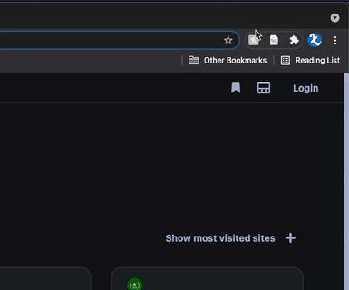

# StackAssist Study - Docker Tasks
## Study Overview
The intention of this study is to investigate the interactions of developer when retrieving programming information from the internet. The participants have been broken down into two groups. Upon recruitment into the study, you will have been assigned to one of these groups by the coordinator.

**SA (StackAssist)**:
The SA group will have StackAssist installed on their !!VSCODE!! window. They are required to use StackAssist for every interaction when retrieving information. If they find that they are unable to extract relevant information from StackAssist, they can resort to the internet to complete the task.

**GPSE (General Purpose Search Engine)**:
The GPSE group will not have access to StackAssist to complete their tasks, only relying on their favourite search engine eg. [Google](https://www.google.com.au/), [Bing](https://www.bing.com/?cc=au).

### Before the Tasks
Before completing the tasks, each participant needs to:
- Ensure the prerequisite software is installed on their machine (listed below)- Fork this repository to for them to upload their answers to the tasks. After completion the forked repository url will be requested

### During the Tasks
Ensure to only use Google Chrome browser whilst conducting the trial for tracking purposes (exporting browsing history)

Both groups have been provided the same 3 tasks and are to be executed in sequential order.

### After each Task
Export your browsing history in Google Chrome using the newly added extension
- Download your last 1hr or 6hr (as needed) of browsing history

- Using VSCode, clip items of your browsing history from prior to starting the task

- Save each file as `browsing_docker_task_{task_num}.json`, these are to be submitted as part of the final survey

### After the Tasks
After completing the tasks, each participant is to:
- Commit and push answers to all tasks in their forked repository
- Open and complete the post-completion survey which has been emailed you to along with this repository link

## Prerequisites
Before preceeding with the tasks, please ensure the following software is installed on your machine.

- [Github Account](https://github.com/)
- [Docker](https://docs.docker.com/get-docker/)
- [Docker Compose](https://docs.docker.com/compose/install/)
- [Export History/Bookmarks (Chrome Extension)](https://chrome.google.com/webstore/detail/export-historybookmarks-t/dcoegfodcnjofhjfbhegcgjgapeichlf?hl=en)
- [Visual Studio Code](https://code.visualstudio.com/download)
- StackAssist VSCode Extension (for SA group only)

## Background
ShipHand is a startup company using [NodeJS](https://nodejs.dev/) to construct a client interface to interact with their management system. They have employed the CEO's nephew, Greg, who has just completed a NodeJS class in high school, to build them two applications, a client application which is intended to contain a graphical interface to their platform as well as a backend application to manage their data.

Greg has simply built the applications on his local machine and hasn't deployed the application to any other device. The ShipHand committee would like to preview and test the applications Greg has built before they deploy them to a cloud platform. Predictably, Greg hasn't deployed an application before because he is only a high school student. As a result, ShipHand has tasked you with building these applications using [Docker](https://www.docker.com/) so each member of their presumably non-technical committee can run the project on their Macbooks.

